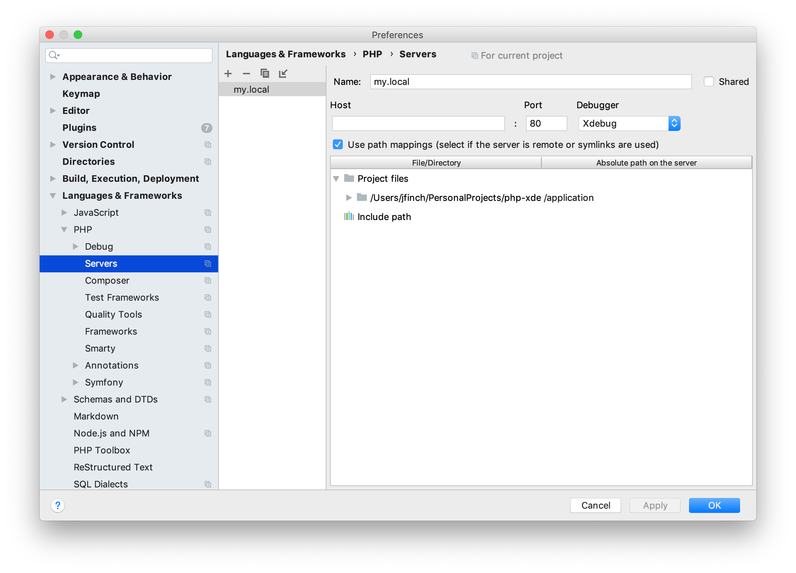

# PHP Xdebug Docker Setup

A tiny xdebug php docker setup. 

The key is the xdebug configuration:
```
xdebug.remote_enable=on
xdebug.remote_autostart=off
xdebug.remote_host=host.docker.internal
```

The xdebug environment variables in the compose file:
```
export PHP_IDE_CONFIG="serverName=my.local"
export XDEBUG_CONFIG="idekey=PHPSTORM"
```

And the path mappings in PHPStorm for the server name.

## Usage

Run:
```
docker-compose up -d
 ```

Go to `Preferences > Languages & Frameworks > PHP > Servers` and create a server with the following path mapping.



Add the xdebug chrome add-on, set a breakpoint in `public/xdebug.php` and start listening for connections in PHPStorm.

Then go to: <http://localhost:8080/xdebug.php>

This should initiate a debug session.

And for CLIs, with the environment variables set in the compose file, it should just work:

```
docker-compose exec php-fpm php cli-xdebug.php
```

Happy debugging! :mag: :bug:
